# 🎨 Skill Badge Generator

Generate beautiful, glowing SVG badges for your skills and technologies section with customizable icons, ratings, and colors.

## ✨ Features

- 🖼️ **Custom Icons**: Automatically embeds PNG icons from `assets/skill/skillInput/`
- ⭐ **Rating System**: Display skill rating out of 10 with star visualization
- 🌟 **Glowing Effects**: Beautiful glow effects around icons and text
- 💫 **Pulse Animation**: Subtle pulse animations for enhanced visual appeal
- 📐 **Individual Badges**: Generate separate SVG files for flexible assembly
- 🎨 **Full Customization**: Colors, sizes, fonts, and effects all configurable
- 🔧 **Flexible Layout**: Assemble badges using HTML tables, lists, or custom layouts

## 🚀 Quick Start

```bash
node src/skill/skill-badge-generator.js
```

This generates individual badge SVGs in `assets/skill/skilloutput/` that you can flexibly assemble in your README using HTML tables, lists, or custom layouts.

## 🎛️ Configuration

### Adding New Skills

Edit the `skillsConfig` array in the generator:

```javascript
{
  name: "React",           // Skill name displayed on badge
  icon: "react.png",       // PNG file in skillInput folder
  rating: 8,               // Rating out of 10
  color: "#61DAFB",        // Primary color for accent and stars
  glowColor: "#61DAFB"     // Glow effect color (can be different from primary)
}
```

### Badge Appearance

Customize the `badgeConfig` object:

```javascript
const badgeConfig = {
  // Dimensions
  width: 300,              // Badge width
  height: 80,              // Badge height
  
  // Colors
  backgroundColor: "#0D1117",  // Dark theme background
  borderColor: "#30363D",      // Border color
  textColor: "#F0F6FC",        // Text color
  ratingColor: "#7C3AED",      // Rating number color
  
  // Typography
  skillFontSize: 16,       // Skill name font size
  ratingFontSize: 14,      // Rating font size
  fontFamily: "Segoe UI, Arial, sans-serif",
  
  // Layout
  iconSize: 40,            // Icon size in pixels
  iconGlowRadius: 15,      // Glow effect radius
  borderRadius: 12,        // Rounded corners
  
  // Effects
  enableGlow: true,        // Enable/disable glow effects
  enablePulse: true,       // Enable/disable pulse animation
  glowIntensity: 10        // Glow effect intensity
};
```

## � Generated Files

### Individual Skill Badges
| Skill | File Name | Relative Path |
|-------|-----------|---------------|
| HTML | `html-badge.svg` | `../../assets/skill/skilloutput/html-badge.svg` |
| CSS | `css-badge.svg` | `../../assets/skill/skilloutput/css-badge.svg` |
| JavaScript | `javascript-badge.svg` | `../../assets/skill/skilloutput/javascript-badge.svg` |
| React | `react-badge.svg` | `../../assets/skill/skilloutput/react-badge.svg` |
| Python | `python-badge.svg` | `../../assets/skill/skilloutput/python-badge.svg` |
| Node.js | `node-js-badge.svg` | `../../assets/skill/skilloutput/node-js-badge.svg` |
| C | `c-badge.svg` | `../../assets/skill/skilloutput/c-badge.svg` |
| C++ | `c---badge.svg` | `../../assets/skill/skilloutput/c---badge.svg` |
| SQL | `sql-badge.svg` | `../../assets/skill/skilloutput/sql-badge.svg` |
| Git | `git-badge.svg` | `../../assets/skill/skilloutput/git-badge.svg` |
| GitHub | `github-badge.svg` | `../../assets/skill/skilloutput/github-badge.svg` |

### Grid Layout
| Type | File Name | Relative Path |
|------|-----------|---------------|
| Complete Grid | ~~`skills-grid.svg`~~ | ~~Removed - use individual badges~~ |

### File Structure
```
assets/skill/
├── skillInput/          # Source PNG icons
│   ├── html5.png
│   ├── css.png
│   ├── js.png
│   ├── react.png
│   ├── python.png
│   ├── nodeJs.png
│   ├── c.png
│   ├── cpp.png
│   ├── sql.png
│   ├── git.png
│   └── github.png
└── skilloutput/         # Generated SVG badges  
    ├── html-badge.svg
    ├── css-badge.svg
    ├── javascript-badge.svg
    ├── react-badge.svg
    ├── python-badge.svg
    ├── node-js-badge.svg
    ├── c-badge.svg
    ├── c---badge.svg
    ├── sql-badge.svg
    ├── git-badge.svg
    ├── github-badge.svg
    └── skills-grid.svg  # Complete 3x4 grid
```

## 🎨 Available Skills

Current configured skills:
- HTML (html5.png) - 9/10
- CSS (css.png) - 8/10  
- JavaScript (js.png) - 8/10
- React (react.png) - 7/10
- Python (python.png) - 8/10
- Node.js (nodeJs.png) - 7/10
- C (c.png) - 6/10
- C++ (cpp.png) - 7/10
- SQL (sql.png) - 6/10
- Git (git.png) - 8/10
- GitHub (github.png) - 8/10

## 🔧 Customization Examples

### Change Colors
```javascript
// Dark theme (default)
backgroundColor: "#0D1117",
textColor: "#F0F6FC"

// Light theme
backgroundColor: "#FFFFFF", 
textColor: "#24292F"

// Custom accent colors
ratingColor: "#7C3AED"  // Purple
ratingColor: "#10B981"  // Green
ratingColor: "#F59E0B"  // Orange
```

### Adjust Effects
```javascript
// Subtle effects
enableGlow: false,
enablePulse: false

// Intense effects  
glowIntensity: 20,
iconGlowRadius: 25

// Fast pulse
// Modify animation duration in pulse animation
```

### Flexible Assembly
- **HTML Tables**: Create custom grid layouts with any number of columns
- **Markdown Lists**: Simple vertical or horizontal lists
- **Custom Layouts**: Mix with other content, add categories, etc.
- **Responsive Design**: Each badge scales independently

## 🎯 Usage in README

### Individual Badges
```markdown
<!-- Individual skill badges -->
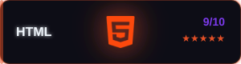
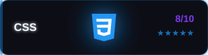
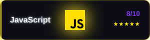
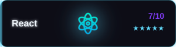
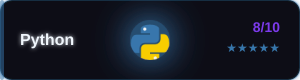
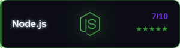
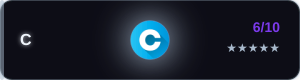
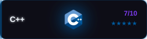
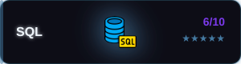
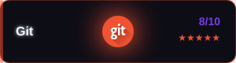
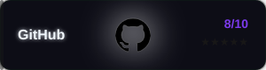
```

### Complete Grid (Individual Assembly)
```markdown
<!-- Use HTML table for flexible grid -->
<table align="center">
  <tr>
    <td></td>
    <td></td>
    <td></td>
  </tr>
  <tr>
    <td></td>
    <td></td>
    <td></td>
  </tr>
</table>
```

### HTML with Custom Sizing
```html
<!-- Individual badges with custom sizing -->


<!-- Complete grid with custom sizing -->
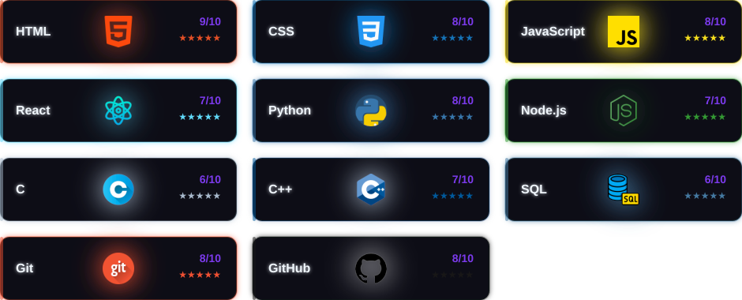
```

### Direct File Paths for Main README
If using from the main README.md file, use these paths:
```markdown
<!-- For main README.md file -->


<!-- Individual badges from main README -->


```

## � Quick Copy-Paste Templates

### For Main README.md File
```markdown
## 🛠️ Skills & Technologies

<!-- Complete skills grid (recommended) -->


<!-- OR individual badges -->


```

### For Subdirectory Files
```markdown
## 🛠️ Skills & Technologies

<!-- Complete skills grid (recommended) -->


<!-- OR individual badges -->


```

### HTML with Custom Layout
```html
<!-- Centered skills section -->
<div align="center">
  <h2>🛠️ Skills & Technologies</h2>
  
</div>

<!-- OR individual badges in rows -->
<div align="center">
  <h2>🛠️ Skills & Technologies</h2>
  
  <!-- Frontend Technologies -->
  <h3>🎨 Frontend</h3>
  
  
  
  
  
  <!-- Backend & Languages -->
  <h3>⚙️ Backend & Languages</h3>
  
  
  
  
  
  <!-- Tools & Database -->
  <h3>🛠️ Tools & Database</h3>
  
  
  
</div>
```

## �📝 Icon Requirements

- **Format**: PNG images
- **Size**: Any size (automatically scaled to 40x40px)
- **Background**: Transparent preferred
- **Quality**: High resolution for crisp display
- **Naming**: Use descriptive filenames (e.g., `react.png`, `nodejs.png`)

## 💡 Tips

1. **Icon Sources**: 
   - [DevIcons](https://devicons.github.io/devicon/)
   - [Simple Icons](https://simpleicons.org/)
   - Official technology websites

2. **Color Harmony**: Use official technology colors for best visual appeal

3. **Rating Guidelines**:
   - 1-3: Beginner
   - 4-6: Intermediate  
   - 7-8: Advanced
   - 9-10: Expert

4. **Performance**: Grid SVG is more efficient than multiple individual images

## 🚀 Advanced Usage

### Batch Processing
The generator automatically processes all skills in the config array and creates both individual and grid layouts.

### Custom Grid Layouts
Modify the `generateSkillsGrid()` function to change:
- Number of columns (`cols` variable)
- Spacing between badges
- Grid arrangement

### Animation Timing
Each badge has slightly different animation timing to create a natural, staggered effect.